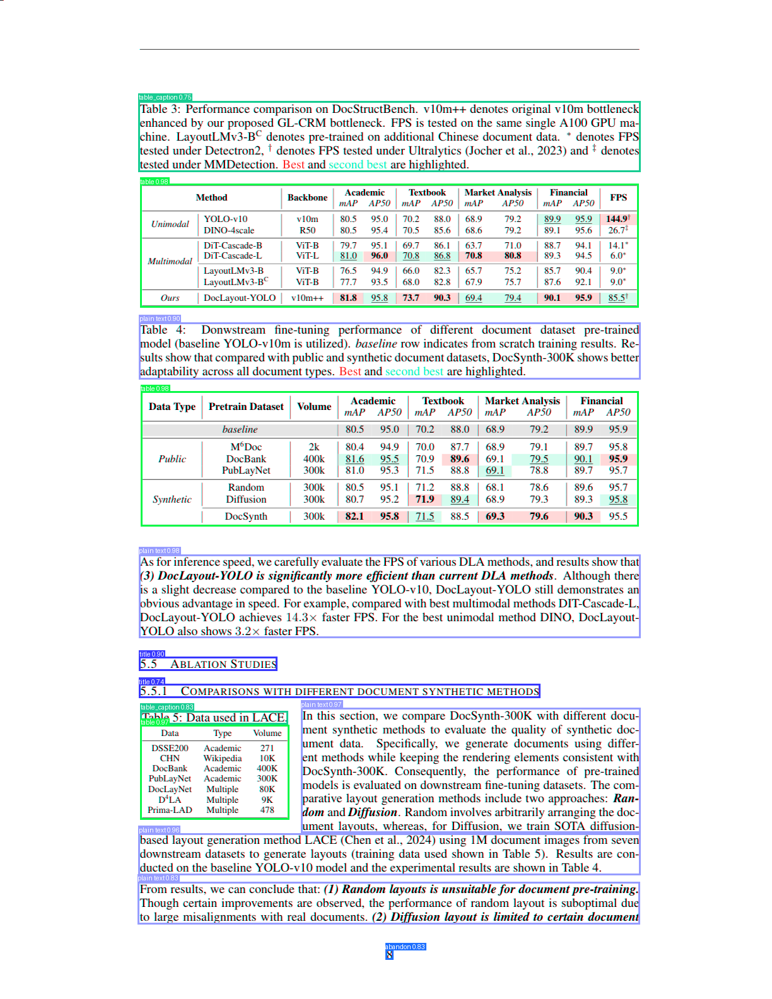

# DocLayout-YOLO Starter

Detect layout elements in PDFs (titles, text, figures, tables) and extract text with OCR using DocLayout-YOLO.



## Quick Start

1. Clone this repo
2. Install dependencies: `pip install doclayout-yolo easyocr pymupdf`
3. Put your PDF in `data/` folder
4. Run `notebooks/exploration.ipynb`

## What You Get

- Annotated images showing detected layout elements
- JSON file with extracted text and document structure
- Visual verification of reading order

**Processing time:** ~2 min with GPU (15 pages), ~20 min on CPU

## Example

```python
from doclayout_yolo import YOLOv10
from huggingface_hub import hf_hub_download

# Download and load model
model_path = hf_hub_download(
    repo_id="juliozhao/DocLayout-YOLO-DocStructBench",
    filename="doclayout_yolo_docstructbench_imgsz1024.pt"
)
model = YOLOv10(model_path)

# Detect layout
results = model.predict("data/yourfile.pdf", imgsz=1024, conf=0.2)
results[0].show()
```

## Features

- Layout detection (titles, text, figures, tables, equations, etc.)
- OCR text extraction with EasyOCR
- Batch processing for efficiency
- Works on Windows/Linux/Mac
- GPU acceleration support

## Use Cases

- Convert PDFs to structured markdown
- Build searchable document databases
- Extract specific sections from papers
- Feed document structure to RAG/LLM systems
- Analyze document layouts at scale

## Resources

- [DocLayout-YOLO](https://github.com/opendatalab/DocLayout-YOLO) - Original repo & paper
- [Paper](https://arxiv.org/abs/2410.12628) - arXiv:2410.12628
- [PDF-Extract-Kit](https://github.com/opendatalab/PDF-Extract-Kit) - Full extraction toolkit
